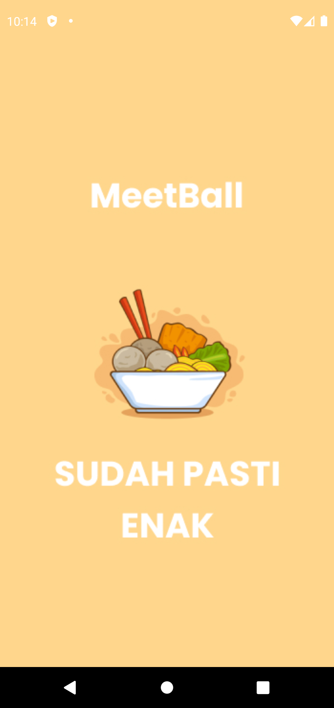
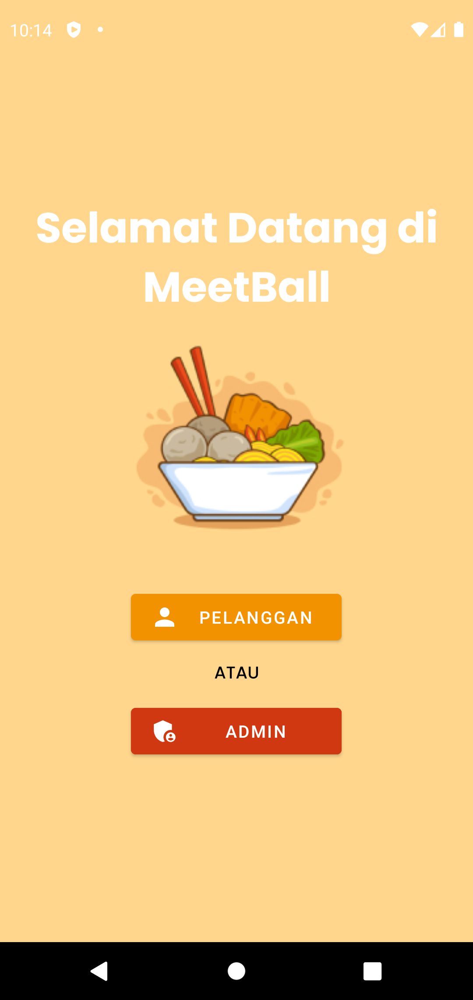

# Meet-Ball Android | UAS Aplikasi Komputasi Bergerak | UNIKOM

Indonesia: Projek ini ditujukan untuk Tugas Akhir (UAS) Mata Kuliah _Aplikasi Komputasi Bergerak_ dengan dosen pengampu Bapak **Sopian Alviana, S.Kom., M.Kom**.

English: This project is aimed for the Final Assignment (Final Semester Examination) of the _Mobile Computing Applications_ course with the lecturer Mr. **Sopian Alviana, S.Kom., M.Kom**.

## Team

- Robi Nurhidayat
- Bagus Perdana Yusuf
- Reza Lutfi Nurdiansyah

## Preview

### Splash Screen

### Landing Page

## Technology stack & Tools

**Program ini membutuhkan:**

| Tech Stack & Tools | Version |
| ------------------ | ------- |
| Java               | 8.0+    |
| Android Studio     | Latest  |

## Setup

### Run Program

1. Buka Software Android Studio
2. Jalankan program di IDE Tersebut (untuk membuka Emulator)
